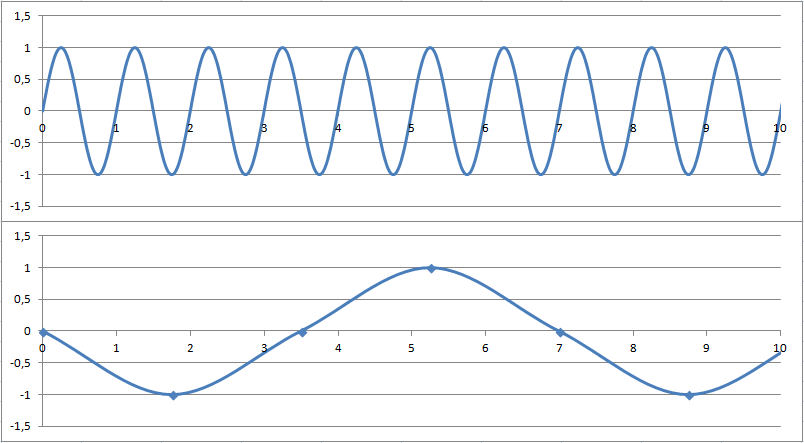
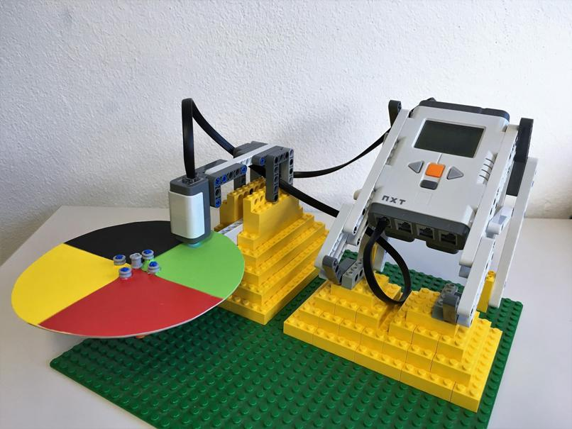
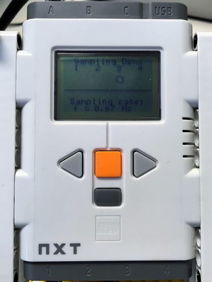
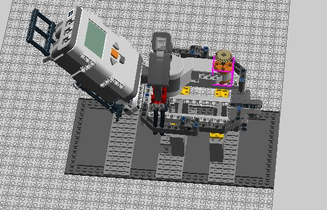

# SAMPLING

## 1 Theory
Whenever you want to record an analog (continuous) signal (e.g.: music from your favorite vinyl) to save it digitally on your computer, you actually only need two things: “sampling” and “quantization”.
Whereas quantization segments the y-axis, namely the amplitude (e.g.: voltage), of your signal into discrete values (see group “Quantization”), sampling basically segments the x- or time-axis of your signal. [1]

### 1.1 Ideal and real sampling
Sampling, which is the process of turning a time-continuous signal into a time-discrete signal, theoretically is done by multiplying a signal (see Figure 3-1, first row [2]) with evenly recurring Dirac impulses. Mathematically speaking, the result will be an evenly time-spaced and amplitude-weighted impulse train representing the original signal (see Figure 3-3, third row [2]). The time between the impulses **T** is called the sampling time. In the case of evenly spaced impulses, the reciprocal sampling time **fs=1/T** is also called the sampling frequency given in Hertz **Hz**, which determines the quantity of sampling points per second. Thus, the unit of **fs** is often also given as **S/s** (samples per second). 
In real world applications (e.g.: analog to digital converter **(ADC)**), sampling is realized by “sample and hold”-circuits (see 2.4 and Figure 3-1, last row [2]). [3]

### 1.2 Frequency domain
Looking at the frequency domain (see Figure 3-1, second column [2]) of a time-discrete signal shows that the frequency components are repeated in a periodical manner shifted by **fs**. Also notice that every signal is mirrored by the y-axis and therefore contain negative frequencies. In a nutshell, only frequencies up to half the sampling frequency can be represented correctly without overlap. This is an important fact in explaining the Shannon theorem (see below). [3]

### 1.3 Shannon Theorem and Aliasing
According to the Shannon Theorem, the sampling frequency should be at least twice as high as the maximum frequency component of your signal **fs >= 2*fmax** to correctly sample the signal without loss of information. 

!["Ideal vs. real sampling[2]"|small](images/dirac_impulse.png "Ideal vs. real sampling[2]")  

Sampling with a frequency less than twice the maximal occurring signal frequency, yields in aliasing effects, which are shown in the figure below. [4]

  
*This illustration shows the aliasing effect. The upper diagram shows the generated analog signal which is a perfect sinusodial signal with a frequency of 1Hz. The lower diagram shows the sampling points with a sample period of 1.75s which results in a sampling frequency of 0.57Hz. So the sampling does not fulfill the Shannon theorem, therefore we have an undersampling which implies that the original signal was some like a distorted sinusodial signal with period 7s.* 

### 1.4 Relevant topics
* [Analog to digital converter (ADC)](https://en.wikipedia.org/wiki/Analog-to-digital_converter)
* [Quantization (also see group “Quantization”)](https://en.wikipedia.org/wiki/Quantization_(signal_processing))
* [Convolution (also see group “Convolution”)](https://en.wikipedia.org/wiki/Convolution)
* [Jitter](https://en.wikipedia.org/wiki/Quantization_(signal_processing))
* [Image Sampling](https://en.wikipedia.org/wiki/Multidimensional_sampling)
* [Upsampling/Interpolation](https://en.wikipedia.org/wiki/Upsampling)
* [Downsampling/Decimation](https://en.wikipedia.org/wiki/Decimation_(signal_processing))
* [Data compression](https://en.wikipedia.org/wiki/Data_compression)
* [Aliasing](https://en.wikipedia.org/wiki/Aliasing)

## 2 Application fields

### 2.1 Audio processing
Sounds are in fact longitudinal oscillations of atoms or moleculs in space [8]. Humans can hear oscillations in a frequency range from 20Hz to 20kHz [5]. These oscillations can be converted into analog electrical signals for example with piezo-sensors or movable inductors. For processing and storing these electrical signals are converted into digital signals. Therefore different sampling rates in a range from 5kHz up to 192kHz can be used [6]. Because some of these sampling rates are even lower than the maximum frequnecy of the oscillations, reconverting of digital audio signals into oscillations of atoms or moleculs may sound completely different to the original signal [7]. (Compare to the second and third other showcase project.)

### 2.2 Digital Graphics
To generate a digital representation of a continuous image, sampling and quantization is used. Instead of looking only at the x-axis (e.g. time) of a traditional signal, now all the 2D coordinates (x- and y-axis) must be segmented into small sub-parts which are also called samples. Therefore, sampling determines the number of pixels/resolution of the digitized image. Naturally, the Shannon Nyquist theorem and aliasing effects also apply to 2D signals, so could aliasing in digital graphics lead to patterns which aren't consisted by the original continuous graphics [7]. Digital cameras use for example CCD-sensors (charge-coupled device) consisting of a matrix of photosensitive diodes with size of some µm. The functional of the diodes is based on photoelectrical effect, so exposure leads to a charge separation proportional to the energy of the light [9]. The analog signal, which first needs to be amplified, also needs to be quantified to get the digital intensity values of the picture. [10]

### 2.3 Digital video processing
Video processing needs the same as processing of digital graphics, but with an additional sampling over the time domain. So that means a digital image is a 2 dimensional grid of sampling points in area and a video is a series of samplings in time. So one could see a digital video as 3 dimensional sampling with one dimension is the sampling over time and the others are samplings over the area. The sampling rate in the time domain is called frame rate. Additionally a video may contain a sound which is again sampled. [11]

### 2.4 Sample and hold
An electrical circuit which “holds” a continuous analog signal (voltage) at a certain level for a specific timeframe. This circuit especially is used in successive approximation analog to digital converters which later quantizes the locked voltage samples [12]. This technique is also used in LCD displays for maintaining each pixel values between the frame refreshes. [13]

### 2.5 Signal transmission
Each digital signal is transmitted in an analog form and has to be digitalized by the receiver again. One current example would be LIFI. Light fidelity is high-speed and fully networked optical wireless communications (**OWC**), OWC is any form of communication that uses light as the transmission medium. It is used in various applications like M2M-communications, health care and underwater vehicles. The sampling method is based on the “Nyquist Sampling based Flicker Modulation” technique. [14]

### 2.6 Pulse Code Modulation (**PCM**)
PCM is used for a digital representation of analog signals in the area of digital telephony, digital audio on computers and other digital audio applications. Therefore the analog signal is sampled in regular intervals with frequencies of 44.1kHz, 48kHz, 96kHZ and 192kHz and 8, 16, 20 and 24 bits per sample. Recovering the original analog signal is done by a so called "Demodulator", which shifts the output value after each sampling period to the new value. [15]

### 2.7 Pulse modulation 
Sample pulse deals with analog signals hence all signals converted to digital signals using ADC devices, the sampling methode can vary between Ideal, Natural and Flat-Top sampling  depending on the type of the device.
**Pulse Amplitude Modellation** is used to sample an analog signal to a digital signal which amplitude in digital domain is proportional to the amplitude in time domain, with constant distance between samples, except in Flat-Top sampling where the amplitude is fixed.
PAM standards are confined on the sampling rate which deals directly with signal quality, and sample ratio is the sampling frequency over frequency itself.
Known applications for PAM are in the area of ethernet, Phoro biology, electronic drivers for LED and digital TVs.
Other methods of Pulse Modulation are PWM Pulse Width Modulation, PCM Pulse Code Modellation, PAM Pulse Amplitide Modellation, PPM Pulse Position Modellation. [16]

### 2.8 Dendrochronology:
Tree-ring dating (Dendrochronology) is the science of dating tree rings according to the light and dark areas of a cut tree trunk. The different color ranges yield from the different annual seasons, staring with the light color showing rapid growing phases during spring and early summer, whereas the dark regions (denser wood) represent the late summer and winter. As expected, counting the rings therefore gives a good approximation of the trees age, however it also contains information about the weather and atmospheric conditions during the lifespan of a tree. Hence, the rings can be seen as “sampling points” of a “weather signal”.[17]

### 2.9 Sampling in statistics:
Taking only some samples from a large dataset is often used in various statistical methods. The principle assumes that the subset is representing the characteristics of the whole dataset. Take for example a political survey before an election. Only a small part of the population is asked for their opinion, but still this represents a good approximation of the whole electors. Sampling in statistics is manly done due to low cost and speed of data collection. [18]

### 2.10 Music Sampling
Despite being not quite the same as sampling in signal processing, sampling in music production can also be used to show the concept. Goal is to capture just a small sequence of an already existing composition like some specific sound or voice to reuse it in a new way. Today, this is usually done digitally, however in the early years of digital produced music (~1970s), a “Sampler” was used to digitalize analog sequences to store them for instance in a digital synthesizer (see Audio Processing). [19]

## 3 Showcase project
### 3.1 Basic concept
The basic concept of the showcase is to show sampling and aliasing effects using a rotating circular plane (constant rotation with a half revolution per second) with a colored surface and a color sensor. The surface of the plane is split into four equally sized partition with different color (black, green, red and yellow). The sampling rate of the color sensor can be varied in 0.01Hz steps in the range between 0.1Hz and 2Hz. Therefore the user can observe aliasing effects for small sampling rates, e.g. that always the same partition is sampled, and a well sampled signal.  

Practically a Lego Mindstorms NXT 2.0 package, which contains a suitable motor and color sensor and an easy programmable processing unit, is used to build this showcase. The figure below shows a prototype of this configuration:
 
  
*Prototype of the showcase using a cardboard circular plate and Lego Mindstorms NXT 2.0*  

The number of the last sampled color (upper part) and the sampling frequency (lower part) are shown on the screen of the processing unit:

    
*The screen of the processing unit while running the showcase. The small circle in the third row always moves to the number of the last sampled color. The digit 1 represents the color black, 2 the color green, 3 the color red and 4 the color yellow.* 

In generell, the showcase can be built according to [this Lego Builder box](https://its-git.fh-salzburg.ac.at/AISM-DSPPT/WS2017/blob/master/Sampling/source/Box4.lxf). To open this file [Lego Builder](http://ldd.lego.com/en-us/download) is required. The image below shows the contained build, which differs noticeably from the prototype: 

  
*Image of the build plan made by Lego Builder* 

### 3.2 Required Hardware
* Lego Mindstorms NXT 2.0 (set 8547): In particular, the NXT processing unit, the NXT motor connected to port A of the NXT processing unit and the NXT color sensor connected to port 1 if the NXT processing unit are needed. In addition, two NXT cables and six AA-batteries are used.
* Lego: To build the chassis, some traditional Lego and Lego technic parts are required. To finish the setup, either look at the plan (Lego Designer) or be creative.
* Plate: A round plate must be prepared showing four different colors (black, green, red & yellow). The best way is to cut cardboard or simply stick a piece of paper to an old unused CD or DVD.  

### 3.3 Source code
As this showcase used the Lego Mindstorms NXT robot, we also used the NXT-G software [20]. It provides a very simple and interactive drag-and-drop environment perfectly capable for educational usage. The code shows three loops (display, sampling and input) running in parallel and is accordingly documented. The code is available for [download](https://its-git.fh-salzburg.ac.at/AISM-DSPPT/WS2017/blob/master/Sampling/source/SamplingDemo.rbtx).

## 4 Other showcase projects
* [Web-demo showing the effects of sampling](http://webdemo.inue.uni-stuttgart.de/webdemos/02_lectures/uebertragungstechnik_1/sampling_theorem/index.php?id=4#)
* [Water experiments with sampling rate of a video camera](https://www.youtube.com/watch?v=uENITui5_jU)
* [Sample rate effects for audio signals](https://www.youtube.com/watch?v=fZzMXdxbOes)
* [Sample rate effects for audio signals](https://www.youtube.com/watch?v=hRhVb6iRArg)
* [Lecture showing sampling in images](https://sisu.ut.ee/imageprocessing/book/2)
* [Explaining sampling and aliasing](https://www.youtube.com/watch?v=yWqrx08UeUs)
* [Showcase aliasing with S.Hawking's voice](https://www.youtube.com/watch?v=v7qjeUFxVwQ)
* [Tree rings explained](https://www.youtube.com/watch?v=IG44MW_iMmI)

## 5 Recources
[1] P.Horowitz, W.Hill, The Art of Electronics, Third Edition, New York: Cambridge University Press, 2015, p.900-902  
[2] G.Jöchtl, Script: Digital Signal Processing, Salzburg, 2012, p.25, fig.3-1  
[3] G.Jöchtl, Script: Digital Signal Processing, Salzburg, 2012, p.24-26  
[4] [Wikipedia, Shannon sampling theorem](https://en.wikipedia.org/wiki/Nyquist%E2%80%93Shannon_sampling_theorem)  
[5] [Human audible area](https://www.leifiphysik.de/akustik/akustische-phaenomene/versuche/hoerbereich)  
[6] [Wikipedia, Microphone](https://de.wikipedia.org/wiki/Mikrofon)  
[7] [Wikipedia, Aliasing effects](https://de.wikipedia.org/wiki/Alias-Effekt)  
[8] P.Tipler, G.Mosca, Physik für Wissenschaftler und Ingenieure, Sixth Edition, Heidelberg: Spektrum Akademischer Verlag, 2009, p.594  
[9] [Wikipedia, CCD Sensoren](https://de.wikipedia.org/wiki/CCD-Sensor)  
[10] [A.Uhl, Script: Imaging & Image Processing, Salzburg, 2016, p.20-28](https://www.cosy.sbg.ac.at/%7Euhl/IPCV.pdf)   
[11] [Wikipedia, Video](https://en.wikipedia.org/wiki/Video#Characteristics_of_video_streams)  
[12] P.Horowitz, W.Hill, The Art of Electronics, Third Edition, New York: Cambridge University Press, 2015, p.183  
[13] [Wikipedia, Sample and Hold](https://en.wikipedia.org/wiki/Sample_and_hold)  
[14] [Current Status and Performance Analysis of Optical Camera Communication Technologies for 5G Networks](http://ieeexplore.ieee.org/document/7890427/)  
[15] [Wikipedia, Pulse-code modulation](https://en.wikipedia.org/wiki/Pulse-code_modulation#Modulation)  
[16] [Pulse Modulation and Sampling](https://www.labvolt.com/downloads/39862_F0.pdf.)  
[17] [Wikipedia, Dendrochronology](https://en.wikipedia.org/wiki/Dendrochronology)  
[18] [Sampling in statistics](https://en.wikipedia.org/wiki/Sampling_(statistics))  
[19] [Wikipedia, Sampling in music](https://en.wikipedia.org/wiki/Sampling_(music))  
[20] [Lego Mindstorms NXT 2.0 software](https://www.lego.com/en-us/mindstorms/downloads/nxt-software-download?ignorereferer=true)  
